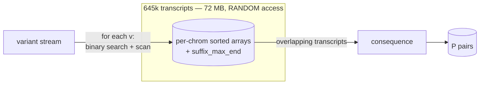
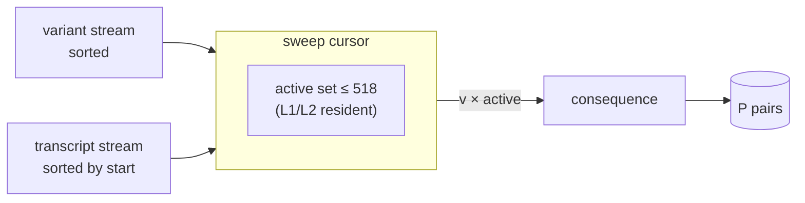
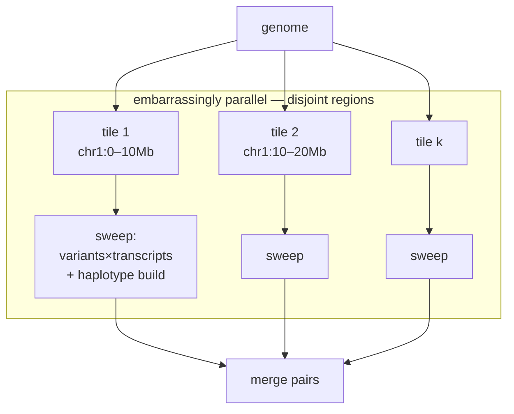
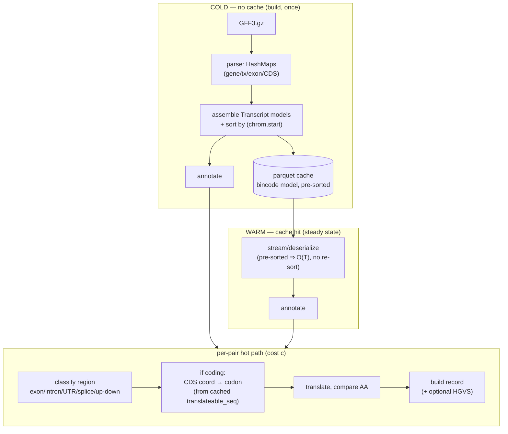

# The consequence kernel: complexity, data structures, and the streaming inversion

> Analysis doc. The point is to reason about the annotation kernel **from first
> principles** — disk-read speed as the baseline, not fastVEP — and to show why
> the *natural* fix (parallelize over variants) is both haplotype-unsafe and
> algorithmically backwards. The numbers below are measured on GIAB HG002 vs the
> Ensembl GRCh38.116 GFF (see `benchmarks/`); they are not illustrative.

## 0. The numbers this analysis stands on

| symbol | meaning | value |
|---|---|---|
| `N` | variants (BCF, position-sorted) | 4,048,342 |
| `T` | transcript intervals in the gene model | 645,457 |
| `P` | emitted `(variant, transcript)` consequence pairs | 46,968,929 (fan-out ≈ 11.6) |
| `D` | max overlap depth (stabbing number) | **518** (avg active 24.5) |
| `B` | raw BCF decode of all records (I/O + bgzf inflate, 1 core) | **3.0 s** |
| — | current scalar kernel, 1 core | 154–177 s |

`D = 518` is the load-bearing fact: at no genomic position do more than 518
transcripts overlap. The set of "currently relevant" transcripts is therefore
*tiny and cache-resident*, which is exactly what a sweep exploits.

## 1. The baseline is the disk, not fastVEP

Annotation reads a variant stream and emits consequences. The hard lower bound is
the cost of **reading and decoding the variants once**:

```
B = 3.0 s   (4.05M BCF records, single core, ~1.3M rec/s — dominated by bgzf inflate)
```

Everything above `B` is compute we *chose* to do. fastVEP (58 s, ~7.6 cores) and
duckvep (154–177 s, 1 core) are two points above this floor; neither is the
floor. The interesting question is not "are we faster than fastVEP" but **"how
many multiples of `B` does the kernel cost, and is that irreducible?"** Today the
single-core kernel is ~50·B. The emit-`P` work is irreducible; the lookup and
memory-traffic around it is not.

A second baseline matters for I/O shape: **sequential vs. random**. `B` assumes a
single front-to-back scan. Any design that *seeks* (random disk access, or random
memory access into a large resident structure) pays a latency multiplier that
never shows up in the asymptotic `O(...)` but dominates the constant.

## 2. The problem, formally

This is a **stabbing join**: for each point `v` (a variant), report every
interval `t` (a transcript) that contains it, then compute one consequence per
`(v, t)`.

```
output = { consequence(v, t)  |  v ∈ variants,  t ∈ transcripts,  t.start ≤ v.pos ≤ t.end }
|output| = P
```

Unconditional lower bound: **Ω(N + T + P)** — you must read every variant, know
every transcript, and emit every pair. With `P ≈ 11.6 N ≫ N + T`, **`P`
dominates**: an optimal kernel is `Θ(P · c)` where `c` is the per-pair
consequence cost. The whole game is (a) keeping the overlap-discovery cost off the
critical path and (b) keeping `c` small and cache-resident.

**The naive baseline is the `N × T` double loop** — test every variant against
every transcript, `O(N·T)`, "a nested loop hoping the cache helps." Every method
below is just a way to skip the pairs that can't overlap; none changes that the
*useful* work is the join. So the only levers that move the needle at scale are
the **memory-access pattern** (does the skip-structure stay in cache?) and
**parallelism** (can the loop run on all cores without contending on shared
memory?). Hold onto that: the asymptotics are a sideshow; cache and cores decide.

## 3. Two strategies for the stabbing join

### (A) Random-access interval index — *what duckvep does today*

This is the **implicit interval tree** of cgranges (Heng Li) — a sorted array
augmented with subtree/suffix max-end, queried by binary search. It is the
field-standard structure (bedtools, mosdepth, htslib region queries) and what
fastVEP itself uses for supplementary-annotation interval joins. duckvep's
`IndexedTranscriptProvider` (sorted-by-start array + `suffix_max_end`) is exactly
a cgranges-style implicit interval tree.

Data structure (`IndexedTranscriptProvider`): per chromosome, an array of
transcripts sorted by `start`, plus a `suffix_max_end[i] = max(end[i..])` array
for early termination.

```
per variant v on chrom c:
  upper = partition_point(start ≤ v.pos)        # binary search   O(log T_c)
  scan i = upper-1 downward:
     if suffix_max_end[i] < v.pos: break        # early out
     if end[i] ≥ v.pos: emit t_i                # collect overlaps O(k_v + slack)
```

* Time: **`O(N·log T + P)`**.
* Memory **access pattern: random**. Each of the `N` variants binary-searches a
  different slice of a **72 MB / 645k-entry** structure. The working set ≫
  L2/L3, so the `log T ≈ 19` probes per variant are mostly **cache misses**, and
  the backward scan walks memory that was never warmed. This is the hidden
  constant behind the 50·B: not the consequence math, but 4.05M × ~19 ≈ **77M
  random probes** into a structure that doesn't fit in cache.
* Memory **footprint**: the entire model is resident (we measured 1.6 GB warm).
* Build: `O(T log T)` sort at load.
* Streaming: variants stream; transcripts are fully resident.



### (B) Sweep-line / sorted-merge join — *the inversion*

Both inputs are **already position-sorted** (BCF is sorted; transcripts we sort
once / store sorted in the cache). Sweep a cursor left→right and keep an **active
set** = transcripts currently spanning the cursor.

```
active = ∅ ; ti = 0 (pointer into transcripts sorted by start)
for each variant v in position order:
    while transcripts[ti].start ≤ v.pos:  active.add(transcripts[ti]); ti += 1
    active.evict(t where t.end < v.pos)        # min-heap by end, or lazy compaction
    for t in active: emit consequence(v, t)
```

* Time: **`O(N + T + P)`** — the `log T` factor **vanishes**. One linear pass.
* Memory **access pattern: sequential** on both streams. The only random
  structure is `active`, bounded by `D = 518` (avg 24.5) → **fits L1/L2**, stays
  hot. No probing of the 72 MB model.
* Memory **footprint: O(D)** — constant, independent of `N` and `T`. Transcripts
  can be *streamed* too; nothing needs to be fully resident.
* No **seeks**: both inputs read front-to-back = max bandwidth, the `B`-friendly
  shape.
* Build: `O(T log T)` once, amortized into the cache (store pre-sorted → `O(T)`
  load).



**The win is not asymptotic on `P`** (both emit `P`). It is: delete the `N·log T`
term; convert 77M random cache-missing probes into a sequential sweep; drop the
footprint from `O(T)` resident to `O(D)` streaming; and turn random I/O into
sequential I/O. That is precisely the gap between "50·B" and "near the
`Θ(P·c)` floor."

## 4. Why "parallelize over variants" is the wrong fix (haplotypes)

The obvious parallelization — shard the `N` variants across threads — is **unsafe
for haplotype-aware consequence** (bcftools-csq / haplosaurus semantics). Phased
variants on the **same transcript and haplotype** interact:

* two SNVs in one codon → a single combined amino-acid change, not two;
* a frameshift indel → re-frames *every downstream* variant on that haplotype;
* a stop-gain upstream → silences downstream consequences (NMD).

So `consequence(v)` is **not independent of v's neighbours** on the same
haplotype×transcript. The correct unit of independent work is therefore **not a
variant** — it is a **transcript** (more precisely a `sample × haplotype ×
transcript` group): take all variants overlapping a transcript, apply them to
that transcript's CDS, translate once.

The sweep-line inversion **already organizes the computation this way** — the
active set *is* the per-transcript grouping. So the parallel decomposition falls
out for free and stays haplotype-correct:



Partition the **genome into tiles** (split only at transcript-free gaps so no
transcript straddles a tile). Each tile = {its transcripts} + {overlapping
variants} = an independent sweep, including haplotype reconstruction. Threads get
tiles, not variants. Phasing is always contained within a tile, so correctness is
preserved with zero cross-thread coordination.

## 5. Data structures and paths — with and without cache



* **Cold** = `O(GFF) parse + O(T log T) assemble`. One-time. (Measured 18 s / 3.2
  GB; memory is the parse intermediates, not the writer — see
  `vep::tcache`/`gff.rs`.)
* **Warm** = `O(T)` if the cache stores transcripts **pre-sorted** (then the
  sweep needs no per-run sort). Today the cache is row-per-transcript parquet with
  a bincode `model` BLOB; for the sweep it should additionally be **sorted by
  `(chrom, start)`** so warm load is a sequential read with no re-sort, and
  ideally **mmappable / columnar** so the sweep streams it without materializing
  645k `Transcript` structs.
* **Hot path cost `c`**: `O(1)` for an SNV (one codon lookup against the cached
  spliced sequence), `O(L)` for indels/HGVS. HGVS is ~13% of `c` and, like in VEP
  and fastVEP, should be **opt-in** (computed only when requested) rather than
  paid on every one of the `P` pairs.

## 6. Where this lands in DuckDB

The sweep is a **stateful, ordered** computation — a stateless per-row scalar
(`vep_consequence(v) → LIST<transcript>`) cannot express it, and that is exactly
why the current kernel is pinned to one core (a serial `read_vcf` table function
feeding a per-variant scalar). Two DuckDB-native shapes recover parallelism *and*
the streaming inversion:

1. **Range join + per-pair scalar.** Express overlap as
   `variants v JOIN transcripts t ON v.chrom = t.chrom AND v.pos BETWEEN t.start AND t.end`.
   DuckDB plans range/IE-joins as a parallel sweep, and `vep_consequence` becomes
   a **per-pair** scalar (`(v, one t) → consequence`) — stateless, parallel,
   optimizer-scheduled. This is the project thesis ("annotation = tables the
   optimizer joins") applied to the kernel itself.
2. **Parallel table function over genome tiles** (§4) for the haplotype path,
   where a group of variants must be reduced against one transcript — a
   partitioned aggregate, not a row-wise join.

Both make the natural one-shot query parallel without manual staging, and both
keep haplotype reconstruction inside an independent unit. The current
per-variant-LIST scalar is the thing to retire.

## 7. Prototype: measured (range join + per-pair scalar)

`vep_consequence_pair(chrom,pos,ref,alt,transcript_id)` annotates a variant
against ONE named transcript, so DuckDB can drive the candidate pairs from a
parallel range join and the kernel stops being a serial per-variant scalar:

```sql
SELECT vep_consequence_pair(v.chrom, v.pos, v.ref, a.alt, t.transcript_id)
FROM read_vcf('HG002.vcf.gz') v, UNNEST(v.alt) a(alt)
JOIN transcripts t
  ON t.chrom = v.chrom AND v.pos BETWEEN t.start - 5000 AND t.end_pos + 5000;
```

| path | wall | cores | core-s | pairs | note |
|---|---|---:|---:|---|---|
| per-variant scalar, serial `read_vcf` | 179 s | 1 | **177** | 46,968,929 | most core-efficient; **1 core** |
| per-variant scalar, **staged** table | 42 s | 13 | 562 | 46,968,929 | parallel via materialization |
| **per-pair + range join (sorted)** | 59 s | 15.6 | 916 | 46,968,776 | fully parallel, order-free |
| **per-pair + range join (shuffled)** | 72 s | 15.9 | 1138 | 46,968,776 | **+22%** = DuckDB's internal sort |
| fastVEP (rayon, no HGVS) | 58 s | 7.6 | 441 | 46,968,887 | reference |

What the prototype proves and disproves:

* **Parallelism was the only blocker.** The per-pair scalar over a range join hits
  15.6 cores (vs 1 for serial `read_vcf`). The serial table function — not the
  kernel — was the cap.
* **Order-independence is a real property.** Sorted and totally shuffled (random
  positions *and* chromosome order) give the **identical** pair count; the range
  join sorts internally, so a worst-case-unordered BCF is still correct and still
  parallel, paying only +22% for the sort. A hand-rolled streaming sweep would
  instead *require* pre-sorted input.
* **But "just parallelize" is not the answer — cache is.** Core-seconds get
  *worse* under parallelism (177 → 562 → 916 → 1138), and the per-pair scalar is
  the worst: 47 M invocations, each an id lookup + a 1-element list marshalled.
  Several cores hammering the shared 72 MB random-access index saturate memory
  bandwidth (the §1 sequential-vs-random point, now visible as the core-second
  blow-up). This is precisely why the **sweep-line** (cache-resident `O(D=518)`
  active set, sequential access) is the real fix and not merely "add threads":
  it attacks the bandwidth wall that parallelism alone runs straight into.
* **Known gap:** the join predicate keys on `v.pos` only, so it drops 153/47 M
  pairs where a multi-base variant overlaps a transcript past its POS anchor. The
  fix is an interval predicate on the full variant span
  (`t.start ≤ v.pos+len(ref)-1+d AND t.end ≥ v.pos-d`); it does not change the
  performance story.

So the ladder is: **serial scalar (1 core)** → **range join unlocks cores but
runs into the bandwidth wall of the random-access (cgranges) index** → **the
sweep-line is what makes the parallel cores actually pay off**. Parallelism and
the streaming inversion are complements, not alternatives.

## 8. Summary

* Baseline is **`B = 3 s` (sequential I/O)**, not fastVEP. Optimal kernel is
  **`Θ(P·c)`**; today we sit at ~50·B because of `N·log T` random, cache-missing
  probes into a 72 MB resident index.
* The **sweep-line inversion** (`O(N+T+P)`, sequential access, `O(D=518)`
  memory, no seeks) removes the lookup overhead and the resident footprint.
* It is also the **only** decomposition that stays **haplotype-correct under
  parallelism**: partition the genome into tiles, sweep each — never shard
  variants.
* Realize it in DuckDB as a **parallel range join + per-pair scalar** (no
  phasing) and a **tiled parallel table function** (phasing), retiring the serial
  `read_vcf` → per-variant-LIST scalar that caps us at one core.
