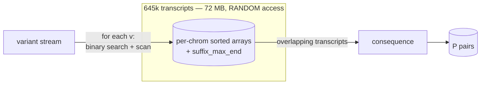
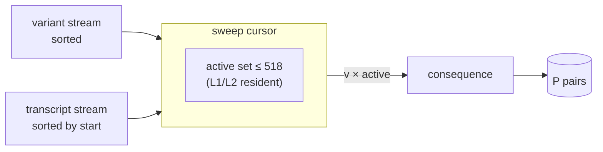
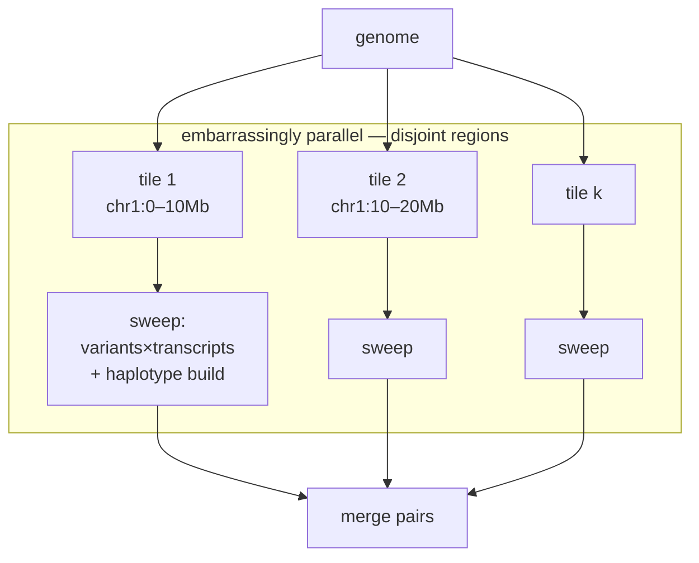
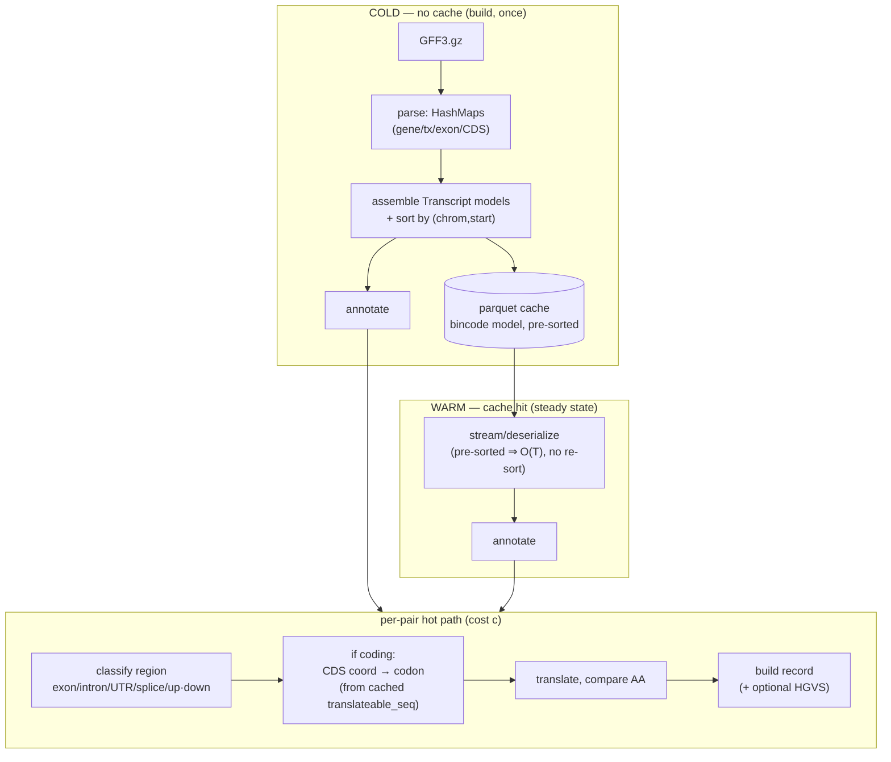

# The consequence kernel: complexity, data structures, and the streaming inversion

> Analysis doc. The point is to reason about the annotation kernel **from first
> principles** — disk-read speed as the baseline, not fastVEP — and to show why
> the *natural* fix (parallelize over variants) is both haplotype-unsafe and
> algorithmically backwards. The numbers below are measured on GIAB HG002 vs the
> Ensembl GRCh38.116 GFF (see `benchmarks/`); they are not illustrative.

## 0. The numbers this analysis stands on

| symbol | meaning | value |
|---|---|---|
| `N` | variants (BCF, position-sorted) | 4,048,342 |
| `T` | transcript intervals in the gene model | 645,457 |
| `P` | emitted `(variant, transcript)` consequence pairs | 46,968,929 (fan-out ≈ 11.6) |
| `D` | max overlap depth (stabbing number) | **518** (avg active 24.5) |
| `B` | raw BCF decode of all records (I/O + bgzf inflate, 1 core) | **3.0 s** |
| — | current scalar kernel, 1 core | 154–177 s |

`D = 518` is the load-bearing fact: at no genomic position do more than 518
transcripts overlap. The set of "currently relevant" transcripts is therefore
*tiny and cache-resident*, which is exactly what a sweep exploits.

## 1. The baseline is the disk, not fastVEP

Annotation reads a variant stream and emits consequences. The hard lower bound is
the cost of **reading and decoding the variants once**:

```
B = 3.0 s   (4.05M BCF records, single core, ~1.3M rec/s — dominated by bgzf inflate)
```

Everything above `B` is compute we *chose* to do. fastVEP (58 s, ~7.6 cores) and
duckvep (154–177 s, 1 core) are two points above this floor; neither is the
floor. The interesting question is not "are we faster than fastVEP" but **"how
many multiples of `B` does the kernel cost, and is that irreducible?"** Today the
single-core kernel is ~50·B. The emit-`P` work is irreducible; the lookup and
memory-traffic around it is not.

A second baseline matters for I/O shape: **sequential vs. random**. `B` assumes a
single front-to-back scan. Any design that *seeks* (random disk access, or random
memory access into a large resident structure) pays a latency multiplier that
never shows up in the asymptotic `O(...)` but dominates the constant.

## 2. The problem, formally

This is a **stabbing join**: for each point `v` (a variant), report every
interval `t` (a transcript) that contains it, then compute one consequence per
`(v, t)`.

```
output = { consequence(v, t)  |  v ∈ variants,  t ∈ transcripts,  t.start ≤ v.pos ≤ t.end }
|output| = P
```

Unconditional lower bound: **Ω(N + T + P)** — you must read every variant, know
every transcript, and emit every pair. With `P ≈ 11.6 N ≫ N + T`, **`P`
dominates**: an optimal kernel is `Θ(P · c)` where `c` is the per-pair
consequence cost. The whole game is (a) keeping the overlap-discovery cost off the
critical path and (b) keeping `c` small and cache-resident.

**The naive baseline is the `N × T` double loop** — test every variant against
every transcript, `O(N·T)`, "a nested loop hoping the cache helps." Every method
below is just a way to skip the pairs that can't overlap; none changes that the
*useful* work is the join. So the only levers that move the needle at scale are
the **memory-access pattern** (does the skip-structure stay in cache?) and
**parallelism** (can the loop run on all cores without contending on shared
memory?). Hold onto that: the asymptotics are a sideshow; cache and cores decide.

## 3. Two strategies for the stabbing join

### (A) Random-access interval index — *what duckvep does today*

This is the **implicit interval tree** of cgranges (Heng Li) — a sorted array
augmented with subtree/suffix max-end, queried by binary search. It is the
field-standard structure (bedtools, mosdepth, htslib region queries) and what
fastVEP itself uses for supplementary-annotation interval joins. duckvep's
`IndexedTranscriptProvider` (sorted-by-start array + `suffix_max_end`) is exactly
a cgranges-style implicit interval tree.

Data structure (`IndexedTranscriptProvider`): per chromosome, an array of
transcripts sorted by `start`, plus a `suffix_max_end[i] = max(end[i..])` array
for early termination.

```
per variant v on chrom c:
  upper = partition_point(start ≤ v.pos)        # binary search   O(log T_c)
  scan i = upper-1 downward:
     if suffix_max_end[i] < v.pos: break        # early out
     if end[i] ≥ v.pos: emit t_i                # collect overlaps O(k_v + slack)
```

* Time: **`O(N·log T + P)`**.
* Memory **access pattern: random**. Each of the `N` variants binary-searches a
  different slice of a **72 MB / 645k-entry** structure. The working set ≫
  L2/L3, so the `log T ≈ 19` probes per variant are mostly **cache misses**, and
  the backward scan walks memory that was never warmed. This is the hidden
  constant behind the 50·B: not the consequence math, but 4.05M × ~19 ≈ **77M
  random probes** into a structure that doesn't fit in cache.
* Memory **footprint**: the entire model is resident (we measured 1.6 GB warm).
* Build: `O(T log T)` sort at load.
* Streaming: variants stream; transcripts are fully resident.



### (B) Sweep-line / sorted-merge join — *the inversion*

Both inputs are **already position-sorted** (BCF is sorted; transcripts we sort
once / store sorted in the cache). Sweep a cursor left→right and keep an **active
set** = transcripts currently spanning the cursor.

```
active = ∅ ; ti = 0 (pointer into transcripts sorted by start)
for each variant v in position order:
    while transcripts[ti].start ≤ v.pos:  active.add(transcripts[ti]); ti += 1
    active.evict(t where t.end < v.pos)        # min-heap by end, or lazy compaction
    for t in active: emit consequence(v, t)
```

* Time: **`O(N + T + P)`** — the `log T` factor **vanishes**. One linear pass.
* Memory **access pattern: sequential** on both streams. The only random
  structure is `active`, bounded by `D = 518` (avg 24.5) → **fits L1/L2**, stays
  hot. No probing of the 72 MB model.
* Memory **footprint: O(D)** — constant, independent of `N` and `T`. Transcripts
  can be *streamed* too; nothing needs to be fully resident.
* No **seeks**: both inputs read front-to-back = max bandwidth, the `B`-friendly
  shape.
* Build: `O(T log T)` once, amortized into the cache (store pre-sorted → `O(T)`
  load).



**The win is not asymptotic on `P`** (both emit `P`). It is: delete the `N·log T`
term; convert 77M random cache-missing probes into a sequential sweep; drop the
footprint from `O(T)` resident to `O(D)` streaming; and turn random I/O into
sequential I/O. That is precisely the gap between "50·B" and "near the
`Θ(P·c)` floor."

## 4. Why "parallelize over variants" is the wrong fix (haplotypes)

The obvious parallelization — shard the `N` variants across threads — is **unsafe
for haplotype-aware consequence** (bcftools-csq / haplosaurus semantics). Phased
variants on the **same transcript and haplotype** interact:

* two SNVs in one codon → a single combined amino-acid change, not two;
* a frameshift indel → re-frames *every downstream* variant on that haplotype;
* a stop-gain upstream → silences downstream consequences (NMD).

So `consequence(v)` is **not independent of v's neighbours** on the same
haplotype×transcript. The correct unit of independent work is therefore **not a
variant** — it is a **transcript** (more precisely a `sample × haplotype ×
transcript` group): take all variants overlapping a transcript, apply them to
that transcript's CDS, translate once.

The sweep-line inversion **already organizes the computation this way** — the
active set *is* the per-transcript grouping. So the parallel decomposition falls
out for free and stays haplotype-correct:



Partition the **genome into tiles** (split only at transcript-free gaps so no
transcript straddles a tile). Each tile = {its transcripts} + {overlapping
variants} = an independent sweep, including haplotype reconstruction. Threads get
tiles, not variants. Phasing is always contained within a tile, so correctness is
preserved with zero cross-thread coordination.

## 5. Data structures and paths — with and without cache



* **Cold** = `O(GFF) parse + O(T log T) assemble`. One-time. (Measured 18 s / 3.2
  GB; memory is the parse intermediates, not the writer — see
  `vep::tcache`/`gff.rs`.)
* **Warm** = `O(T)` if the cache stores transcripts **pre-sorted** (then the
  sweep needs no per-run sort). Today the cache is row-per-transcript parquet with
  a bincode `model` BLOB; for the sweep it should additionally be **sorted by
  `(chrom, start)`** so warm load is a sequential read with no re-sort, and
  ideally **mmappable / columnar** so the sweep streams it without materializing
  645k `Transcript` structs.
* **Hot path cost `c`**: `O(1)` for an SNV (one codon lookup against the cached
  spliced sequence), `O(L)` for indels/HGVS. HGVS is ~13% of `c` and, like in VEP
  and fastVEP, should be **opt-in** (computed only when requested) rather than
  paid on every one of the `P` pairs.

## 6. Where this lands in DuckDB

The sweep is a **stateful, ordered** computation — a stateless per-row scalar
(`vep_consequence(v) → LIST<transcript>`) cannot express it, and that is exactly
why the current kernel is pinned to one core (a serial `read_vcf` table function
feeding a per-variant scalar). Two DuckDB-native shapes recover parallelism *and*
the streaming inversion:

1. **Range join + per-pair scalar.** Express overlap as
   `variants v JOIN transcripts t ON v.chrom = t.chrom AND v.pos BETWEEN t.start AND t.end`.
   DuckDB plans range/IE-joins as a parallel sweep, and `vep_consequence` becomes
   a **per-pair** scalar (`(v, one t) → consequence`) — stateless, parallel,
   optimizer-scheduled. This is the project thesis ("annotation = tables the
   optimizer joins") applied to the kernel itself.
2. **Parallel table function over genome tiles** (§4) for the haplotype path,
   where a group of variants must be reduced against one transcript — a
   partitioned aggregate, not a row-wise join.

Both make the natural one-shot query parallel without manual staging, and both
keep haplotype reconstruction inside an independent unit. The current
per-variant-LIST scalar is the thing to retire.

## 7. Prototype: measured (range join + per-pair scalar)

`vep_consequence_pair(chrom,pos,ref,alt,transcript_id)` annotates a variant
against ONE named transcript, so DuckDB can drive the candidate pairs from a
parallel range join and the kernel stops being a serial per-variant scalar:

```sql
SELECT vep_consequence_pair(v.chrom, v.pos, v.ref, a.alt, t.transcript_id)
FROM read_vcf('HG002.vcf.gz') v, UNNEST(v.alt) a(alt)
JOIN transcripts t
  ON t.chrom = v.chrom AND v.pos BETWEEN t.start - 5000 AND t.end_pos + 5000;
```

| path | wall | cores | core-s | pairs | note |
|---|---|---:|---:|---|---|
| per-variant scalar, serial `read_vcf` | 179 s | 1 | **177** | 46,968,929 | most core-efficient; **1 core** |
| per-variant scalar, **staged** table | 42 s | 13 | 562 | 46,968,929 | parallel via materialization |
| **per-pair + range join (sorted)** | 59 s | 15.6 | 916 | 46,968,776 | fully parallel, order-free |
| **per-pair + range join (shuffled)** | 72 s | 15.9 | 1138 | 46,968,776 | **+22%** = DuckDB's internal sort |
| fastVEP (rayon, no HGVS) | 58 s | 7.6 | 441 | 46,968,887 | reference |

**Explicit thread scaling** (`SET threads=N`, per-pair range join, full-span
predicate, real 47M-pair annotation):

| threads | wall | speedup | efficiency | CPU | peak RSS |
|---:|---:|---:|---:|---:|---:|
| 1 | 315.8 s | 1.00× | 1.00 | 99% | 2049 MB |
| 2 | 172.8 s | 1.83× | 0.91 | 195% | 2126 MB |
| 4 | 115.0 s | 2.75× | 0.69 | 377% | 2104 MB |
| 8 | 79.4 s | 3.98× | 0.50 | 707% | 2355 MB |
| 16 | 60.6 s | 5.21× | 0.33 | 1333% | 2490 MB |

* **Efficiency collapses 0.91 → 0.33.** Cores stay busy (CPU → 1333%) but wall
  does not follow — 16 threads buy 5.2×, not 16×. This is the §1 random-vs-
  sequential bandwidth wall made visible: many cores concurrently probing the
  shared 72 MB random-access (cgranges) index saturate memory bandwidth. It is
  the empirical proof that **threads alone plateau**; the sweep-line's cache-
  resident `O(D=518)` active set is what would restore per-core efficiency.
* **Memory is bounded and predictable.** Base ≈ 2.0 GB at 1 thread, rising only
  ~+30 MB/thread (2049 → 2490 at 16t). The base is the transcript model held
  **twice** — the engine's resident `EngineContext` (~1.6 GB of full `Transcript`
  structs, needed by the per-pair `get_by_id`) **plus** DuckDB's `read_parquet`
  of the join columns. The model must be resident for the kernel, but the
  `read_parquet` copy is removable via a `vep_transcripts()` table function over
  the same in-memory structure. Per-thread state is small; memory does not gate
  scaling.

What the prototype proves and disproves:

* **Parallelism was the only blocker.** The per-pair scalar over a range join hits
  15.6 cores (vs 1 for serial `read_vcf`). The serial table function — not the
  kernel — was the cap.
* **Order-independence is a real property.** Sorted and totally shuffled (random
  positions *and* chromosome order) give the **identical** pair count; the range
  join sorts internally, so a worst-case-unordered BCF is still correct and still
  parallel, paying only +22% for the sort. A hand-rolled streaming sweep would
  instead *require* pre-sorted input.
* **But "just parallelize" is not the answer — cache is.** Core-seconds get
  *worse* under parallelism (177 → 562 → 916 → 1138), and the per-pair scalar is
  the worst: 47 M invocations, each an id lookup + a 1-element list marshalled.
  Several cores hammering the shared 72 MB random-access index saturate memory
  bandwidth (the §1 sequential-vs-random point, now visible as the core-second
  blow-up). This is precisely why the **sweep-line** (cache-resident `O(D=518)`
  active set, sequential access) is the real fix and not merely "add threads":
  it attacks the bandwidth wall that parallelism alone runs straight into.
* **Known gap:** the join predicate keys on `v.pos` only, so it drops 153/47 M
  pairs where a multi-base variant overlaps a transcript past its POS anchor. The
  fix is an interval predicate on the full variant span
  (`t.start ≤ v.pos+len(ref)-1+d AND t.end ≥ v.pos-d`); it does not change the
  performance story.

So the ladder is: **serial scalar (1 core)** → **range join unlocks cores but
runs into the bandwidth wall of the random-access (cgranges) index** → **the
sweep-line is what makes the parallel cores actually pay off**. Parallelism and
the streaming inversion are complements, not alternatives.

### Negative result: a custom transcript table function is *worse* SQL

The obvious "better SQL" idea — expose the resident model as a `vep_transcripts()`
table function and `JOIN` it directly (one source of truth, no parquet re-read) —
measured **worse on every axis**:

| join source | wall | CPU | peak RSS |
|---|---|---|---|
| `read_parquet(cache)` (native scan) | 61 s | 1333% (~13 cores) | 2.49 GB |
| `vep_transcripts()` (table function) | 185 s | 222% (~2 cores) | 6.24 GB |

Same count, but **3× slower, 2.5× the memory, barely parallel** (1.9 M page
faults). The cause is the same as the serial `read_vcf`: a custom table function
is an **eager, serial, statistics-less scan**. `read_parquet` hands DuckDB
**row-group zone-maps (min/max)** so the range-join optimizer can **prune and
partition**, plus a **parallel** scan; the table function offers neither, so the
planner falls back to a worse, serial, memory-heavy plan.

And the same holds for a **persisted `.duckdb` table you `ATTACH`** instead of
`read_parquet`:

| transcript join source | wall | CPU | on-disk |
|---|---|---|---|
| `read_parquet(cache)` | 60 s | 1333% (~13 cores) | 46 MB |
| `ATTACH gene_model.duckdb` table | 82 s | 448% (~4.5 cores) | 483 MB full / 12.6 MB lean |

**Correction — it is the row-group count, not the storage format.** The first
reading of this table ("ATTACH is worse, Parquet wins") was *confounded* and is
retracted. The two sources had wildly different scan granularity:

| transcript source | row groups | cores | wall |
|---|---|---|---|
| parquet @ 8192 rows/group | 79 | **13** | 44.9 s |
| parquet @ 122,880 rows/group | 6 | **5.2** | 79.3 s |
| `.duckdb` table (default storage) | 6 | 4.5 | 82 s |
| `vep_transcripts()` table fn | 1 stream | 2.2 | 185 s |

Morsel-driven parallelism is bounded by the **build-side scan's row-group count**.
Re-encoding the *same* parquet at 122,880 rows/group collapses it to 5 cores —
matching the `.duckdb` table. The table was never worse *as storage*; it just had
6 groups by default. **And `.duckdb`'s row-group size IS tunable** —
`ATTACH 'f.duckdb' (ROW_GROUP_SIZE 8192)` yields 79 groups and the join then runs
in **45 s at 12 cores, matching the parquet** (measured). So the earlier
"native row groups are fixed at 122,880" was wrong, and `ATTACH` is a fully viable
hot-path source when created at a fine row-group size. My parquet had 79 groups
only because `BATCH_ROWS = 8192` (chosen for the streaming writer's memory bound)
doubles as the Parquet row-group size — an *accidental* good tune.
`vep_transcripts()`'s 2 cores is the same effect maxed out: one non-partitioned
stream = one morsel.

**Where the time actually goes (benchmark ladder, threads=16, no FASTA):**

| step | wall | cores |
|---|---|---|
| A. join only (candidate pairs, no scalar) | 31.2 s | 11.4 |
| C. join + per-pair consequence kernel | 45.0 s | 12 |

The **DuckDB range join is ~70% of the wall (31 s); the Rust kernel adds ~30%
(~14 s)** in this config. So the object-heavy per-pair kernel is real but **not the
dominant wall-clock cost** — the join is. (Caveat: no-FASTA kernel; the coding path
grows the kernel share — a FASTA ladder is still owed.)

**Tile-sweep prototype — the architecture bet, VALIDATED (`examples/tile_sweep.rs`).**
A single-threaded per-chromosome two-pointer sweep over the compact integer
interval columns (chrom_id/start/end as SoA), maintaining an active set and
**emitting every (variant, transcript) pair**:

| candidate generation | wall | cores | core-s |
|---|---|---|---|
| DuckDB range join (materialized) | 31.2 s | 11 | ~343 |
| **tile-sweep, emit all 47 M pairs** | **0.047 s** | **1** | **0.05** |

Same 46.97 M pairs (0.0004% off — SNV-point approximation; max active set 525,
matching the measured stabbing number). **~660× faster in wall, ~7,300× fewer
core-seconds.**

**Prototype C — sweep + full structural classification (`examples/sweep_classify.rs`).**
Adds a branch-light SoA region classifier (exon/intron/CDS/UTR/splice/up/down) over
compact integer columns + an offset/count exon pool (`vep_exons()`), for **every**
pair, no allocations/strings:

| step | wall | cores |
|---|---|---|
| DuckDB full join + scalar kernel | 45.0 s | 12 |
| **sweep + region masks, all 47 M pairs** | **0.673 s** | **1** |

**~67× faster wall, ~800× fewer core-seconds.** And the mask histogram is the
punchline: of 47 M pairs, **79% intron, only 0.5% (256 k) CDS**. So the heavy
sequence/codon kernel applies to **256 k pairs, not 47 M** (~180× less) — the
libsais/bucketed-kernel insight, measured. The current `annotate_over` runs the
full object path on all 47 M; the sweep engine runs cheap masks on 47 M and the
codon kernel only on the CDS bucket. Projected: I/O-bound VCF read (~3–7 s) + ~1 s
kernel, vs today's 45 s. (Caveat: masks are coarse — splice = within-8bp, UTR not
5′/3′-split — semantics get faithful in the real port; the *cost structure* is what
this proves.)

**Prototype D — codon kernel on the CDS bucket (`examples/codon_bench.rs`).** All
457 M CDS bases packed nt2 (2 bits/base → 114 MB, 4× smaller than ASCII); 256 k
codon classifications (the measured CDS-bucket size) with random access (the
realistic scattered-CDS cache pattern): fetch ref codon, apply alt, translate
ref+alt via a 64-entry LUT, classify syn/missense/stop. **13 ms single-threaded**
(memory-latency-bound, as libsais predicts — but tiny because the bucket is small).

**The complete cost picture, measured (HG002 WGS, single thread):**

| stage | unit | wall |
|---|---|---|
| candidate generation (sweep) | 47 M pairs | 0.047 s |
| structural classification (masks) | 47 M pairs | 0.673 s |
| codon kernel | 256 k CDS | 0.013 s |
| **total compute** | | **~0.73 s** |

vs DuckDB's current path **45 s / 12 cores** → **~60× faster wall, ~700× fewer
core-seconds**. The whole VEP consequence computation is **~0.73 s of compute**; the
45 s is ~98% overhead (general-purpose join materialization + object-heavy per-pair
kernel + string marshalling). The engine becomes **I/O-bound on the VCF read** —
exactly the §1 disk baseline. This is the full empirical justification for the
big-bang sweep-engine over SoA: build the tiled sweep + branch-light masks +
bucketed codon kernel + late opt-in HGVS, with fastVEP demoted to a regression
oracle. So the "join is 70% of wall" finding does **not** mean candidate
generation is expensive — it means DuckDB's general-purpose hash-join is
catastrophically wasteful for an interval sweep. Overlap discovery is intrinsically
~50 ms. With the sweep, candidate generation **evaporates**, the engine becomes
I/O-bound on the VCF read (~3–7 s) plus the per-pair consequence kernel — which
makes the **no-alloc `ConsequenceLite` kernel the next (and now dominant) lever**,
and the tiled sweep the haplotype-safe parallel unit. This is the empirical green
light for the big-bang sweep-engine rewrite.

**`tx_idx` measured NEUTRAL — a falsified prediction.** Both reviews (and I)
predicted a compact `tx_idx` integer key would be "the no-regret win hitting both
slices" (smaller join payload + no per-pair string lookup). Built and measured at
16 threads: `tx_idx` **44.71 s** vs `transcript_id` **44.47 s** — a wash (RSS 1453
vs 1475 MB). The key size is *not* the join's cost (its cost is the hash-on-`chrom`
structure + 47 M cardinality + random access), and the `Arc<str>` lookup was
already cheap next to `annotate_over`'s per-pair allocations. So `tx_idx` is kept
only as the **SoA foundation** (flat ordinal storage + cache `tx_idx` column — what
the sweep and compact kernel need), not as a speedup. The two real levers are
unchanged: **tile/sweep** for the join's 31 s, **no-alloc `ConsequenceLite`** for
the kernel's 14 s.

Corrected lessons:
* **Row-group size is a first-class tuning knob.** ~8192 rows/group (→ tens of
  groups for the gene model) parallelizes the join well; 122,880 starves it. This
  is the real reason `read_parquet` beat the table — Parquet's row-group size is
  **tunable**, DuckDB native storage's is not.
* A **custom table function still loses** — not on statistics this time but on
  *partitioning*: it emits a single stream, so the scan can't be split into morsels
  at all. Keep it for interactive use, not the bulk join.
* `ATTACH` remains the right home for the **annotation-database ecosystem** (gnomAD
  / ClinVar / panels), and a `.duckdb` join would be competitive *if* its row-group
  count were controllable; today it is capped by the 122,880 constant.

The standing lesson holds — lean on DuckDB's native scans — but the *mechanism* is
**row-group granularity of the build side**, not "Parquet is magic." The real
levers are (1) keep the native parquet scan; (2) store the cache **sorted by
`(chrom, start)`** so zone-maps are tight and pruning is maximal; (3) shrink the
per-pair scalar to return a nullable **`STRUCT`** instead of `LIST<STRUCT>` (kills
47 M one-element-list allocations; lets `WHERE c IS NOT NULL` push down). The
double-resident model is not worth a table function to "fix" — the engine must be
resident for the sequence kernel regardless, and the parquet scan's cost is what
*buys* the parallelism. `vep_transcripts()` remains useful for *interactive*
gene-model queries (panels, biotype filters, SA-style joins on 645k rows), just
not as the bulk-annotation join driver.

## 8. One join, four granularities: SV, haplotype, supplementary annotation

Consequence prediction is not a special problem — it is one instance of "match
variants against a reference set." The same machinery covers structural variants,
supplementary annotation, and (with one twist) haplotypes:

| task | what is matched | join shape | DuckDB primitive | fastVEP hand-rolls it as |
|---|---|---|---|---|
| **SA point** (gnomAD AF, ClinVar-by-variant) | exact `(chrom,pos,ref,alt)` | equi-join | hash join + Parquet zone-maps + bloom | `var32` packed key + bloom + block min/max |
| **consequence** (SNV/indel) | point ∈ transcript interval | range join | IEJoin / piecewise merge | cgranges interval index |
| **SV consequence** | SV span `[pos,END]` ∩ transcript | interval ∩ interval | range join (IEJoin) | interval index + END handling |
| **SA region** (panel / BED / regulatory) | interval ∩ interval | range join | IEJoin | `.osi`/`.oga` interval index |
| **haplotype** | variants grouped per `sample × hap × transcript` | partitioned aggregate | `GROUP BY` / window | per-transcript buffered reduce |

Only **haplotype is stateful**; the rest are stateless joins. The consequence
kernel is the SA interval-join with a *heavy* per-pair function (predict a
consequence) where SA has a *light* one (pick up an AF column).

### SVs

SVs **span** `[pos, END]` (`INFO/END` for symbolic `<DEL>`/`<DUP>`/`<CNV>`/
`<INV>`; the mate for breakends) and carry their own vocabulary
(`transcript_ablation`, `feature_truncation`, `copy_number_*`). The engine
already dispatches them — `annotate_over` partitions symbolic vs sequence alleles
and routes symbolic ones to `predict_sv_consequences` via `classify_sv_type`.
What the **join** needs:

* an interval ∩ interval predicate: `t.start ≤ v.END + d AND t.end ≥ v.pos − d`;
* `read_vcf` to surface `INFO/END`, and a 6-arg END-aware
  `vep_consequence_pair(chrom, pos, END, ref, alt, tid)` (the per-*variant*
  scalar already has the 5-arg END form; the per-pair one currently passes
  `end = pos`, so it does not span SVs yet).

Hazard: **fan-out** — a chromosome-scale `<DEL>` overlaps thousands of
transcripts (one variant, huge output). Inherent, not an algorithm flaw; the
sweep keeps the SV "active" across the run of transcripts it spans.

### Haplotypes — the one that is *not* a per-pair join

Phased variants on the same transcript+haplotype **interact**: two SNVs in one
codon → a single combined amino-acid change; a frameshift re-frames everything
downstream; a stop-gain triggers NMD. So `consequence(v, t)` is **not**
independent of `v`'s phased neighbours, and a per-`(variant, transcript)` join is
wrong by construction. The correct shape is a **partitioned aggregate**:

```sql
SELECT sample, haplotype, t.transcript_id,
       vep_haplotype_consequence(v.chrom, t.transcript_id,
           list(struct_pack(v.pos, v.ref, v.alt) ORDER BY v.pos))
FROM phased_variants v
JOIN transcripts t ON t.chrom = v.chrom AND v.pos BETWEEN t.start - d AND t.end_pos + d
GROUP BY sample, haplotype, t.transcript_id;
```

duckvep already ships the kernel (`vep_haplotype_consequence`, the
haplosaurus/multi-edit path, experimental). The key realization: **DuckDB's
hash-partitioned `GROUP BY` *is* the genome-tiling decomposition of §4** — it
places each `sample × hap × transcript` group on one thread automatically, so
phasing stays contained and the work still parallelizes. Haplotypes do not block
parallelism; they require the **aggregate** shape, with the range join as its
*input* rather than the final step. (This is also why sharding by variant is
unsafe — a group's variants must travel together.)

### How fastVEP does supplementary annotation — the same problem, hand-rolled

`fastvep-sa` (~7.7k LOC: `var32`/`kmer16`/`bloom`/`block`/`chunk`/`index`,
`.osa`/`.osi`/`.oga`) is a hand-rolled query engine for exactly these joins:

* **Exact annotation** — `var32` packs `(chrom,pos,ref,alt)` into a key; a
  **bloom filter** skips blocks that cannot contain it; **binning + block
  min/max** skip ranges. That is a **hash equi-join + zone-maps + bloom
  pre-filter**, built by hand.
* **Region annotation** — an **interval index** (cgranges tree) = a **range
  join**, built by hand.

DuckDB provides both natively: Parquet row-group min/max **are** zone maps, hash
joins build **bloom filters** automatically, range joins **are** the IEJoin. So
`var32 + bloom + block ≡ variants JOIN gnomad USING (chrom,pos,ref,alt)`, and the
SA interval index ≡ our consequence range join. The project thesis (plan §C, and
the annotation-SQL-API design) is precisely to **retire the hand-rolled SA engine
and express every annotation — point, interval, consequence — as a Parquet join
the optimizer plans and parallelizes.** The consequence kernel is the first and
heaviest of these; getting its join shape right (range join for SNV/SV, partitioned
aggregate for haplotypes) is what makes the rest fall out as ordinary SQL.

## 9. The SQL surface (`sql/vep.sql`) and what it measured

The "better SQL" is annotation as joins the optimizer plans, over a source-agnostic
relation — not a black-box `annotate_vcf(path)`, and not a custom table function in
the hot path. Contract: `src` yields one row per ALT with
`(chrom, pos UBIGINT, end_pos UBIGINT, ref, alt)` (real `end_pos` = `INFO/END` for
SVs). The mantra that survived measurement:

* **`SET VARIABLE`** for paths/params (safe; does not break range-join recognition
  when kept out of the hot inequality — verified).
* **`CREATE TEMP TABLE` + `ANALYZE`** to normalize/materialize the variant source
  **once** (avoids re-scanning `read_vcf`; gives the planner statistics).
* **native `read_parquet(cache)`** for the transcript side (zone-maps + parallel),
  **never** `vep_transcripts()` for the bulk join (§8 negative result).
* **`vep_consequence_pair(...) -> nullable STRUCT`**, not `LIST<STRUCT>` — no
  `LATERAL UNNEST`, no 47 M one-element lists; `WHERE c IS NOT NULL` filters.
* **lean join**: only `transcript_id` flows through the 47 M-row join; the STRUCT
  scalar returns gene/biotype/HGVS (carrying them in the join cost ~30 s at WGS).
* **full-span predicate** `t.start ≤ v.end_pos + d AND t.end_pos ≥ v.pos − d` for
  correct interval overlap (SVs and multi-base variants).

Measured (HG002, 46,968,985 pairs, `threads=16`):

| shape | wall | RSS |
|---|---|---|
| LIST + UNNEST, inline `read_parquet` | 60.6 s | 2.49 GB |
| STRUCT, lean inline `read_parquet` | 59.9 s | 2.55 GB |
| STRUCT, lean `vep_annotate` macro (materialize-once + sorted cache) | 78.7 s | **1.65 GB** |

STRUCT ties LIST on wall but is leaner; the macro's materialize-once `TEMP TABLE`
adds a serial step (~+30%) for a single query but **drops RSS to ~the resident
model (1.65 GB)** and is reusable across repeated annotation/SA queries on the same
variants. The cache is now written **sorted by `(chrom, start)`** so zone-maps are
tight — this pays off for *selective* region/panel queries (pruning row groups),
not the full-genome scan (which touches every group).

**EXPLAIN guardrail (honest caveat):** DuckDB plans this as a parallel
`HASH_JOIN` on `chrom` **+ a range filter**, not a pure IEJoin/range join. It
parallelizes, but the `chrom` equality dominates (≈24 skewed hash buckets), so the
range is applied as a post-hash filter. Forcing a true range join (or a tx ordinal
to partition more evenly) is the next optimization; the current plan is parallel
and correct but not the textbook range join.

## 10. Summary

* Baseline is **`B = 3 s` (sequential I/O)**, not fastVEP. Optimal kernel is
  **`Θ(P·c)`**; today we sit at ~50·B because of `N·log T` random, cache-missing
  probes into a 72 MB resident index.
* The **sweep-line inversion** (`O(N+T+P)`, sequential access, `O(D=518)`
  memory, no seeks) removes the lookup overhead and the resident footprint.
* It is also the **only** decomposition that stays **haplotype-correct under
  parallelism**: partition the genome into tiles, sweep each — never shard
  variants.
* Realize it in DuckDB as a **parallel range join + per-pair scalar** (no
  phasing) and a **tiled parallel table function** (phasing), retiring the serial
  `read_vcf` → per-variant-LIST scalar that caps us at one core.

### Region parallelization (answering "these were all single-threaded")

The prototypes above are single-threaded. Parallelizing the sweep+classify over
chromosomes (`examples/sweep_parallel.rs`, work-stealing tiles):

| threads | wall | speedup | efficiency |
|---|---|---|---|
| 1 | 0.504 s | 1.0× | — |
| 2 | 0.270 s | 1.87× | 0.93 |
| 4 | 0.141 s | 3.6× | 0.89 |
| 8 | 0.085 s | 5.9× | 0.74 |
| 16 | 0.065 s | 7.7× | 0.48 |

The sweep scales **far better than the random-access index** (0.74@8 / 0.48@16 vs
the cgranges index's 0.33@16) — sequential, cache-local streams with an L1/L2-
resident active set don't hit the §8 memory-bandwidth wall. The 16-thread falloff
is work granularity (22 chromosomes, chr1 the long pole); finer genome tiles fix
it. But it's **moot**: 65 ms at 16 cores is ~50× below the 3 s I/O floor. The
kernel is no longer the bottleneck under any thread count — **the VCF read is**, so
the remaining parallelism budget belongs on parallel BGZF reading, not the kernel.
Region tiles are also the haplotype-safe parallel unit, so this is the same
decomposition correctness needs.
